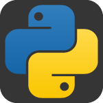

## 👨‍💻 About Me
Cybersecurity student focused on networking and offensive security — exploring how systems work and how they break.  
Building hands-on skills in penetration testing and network analysis.  

## Stack

  
  
  
  

> Learning. Testing. Breaking. Improving.
